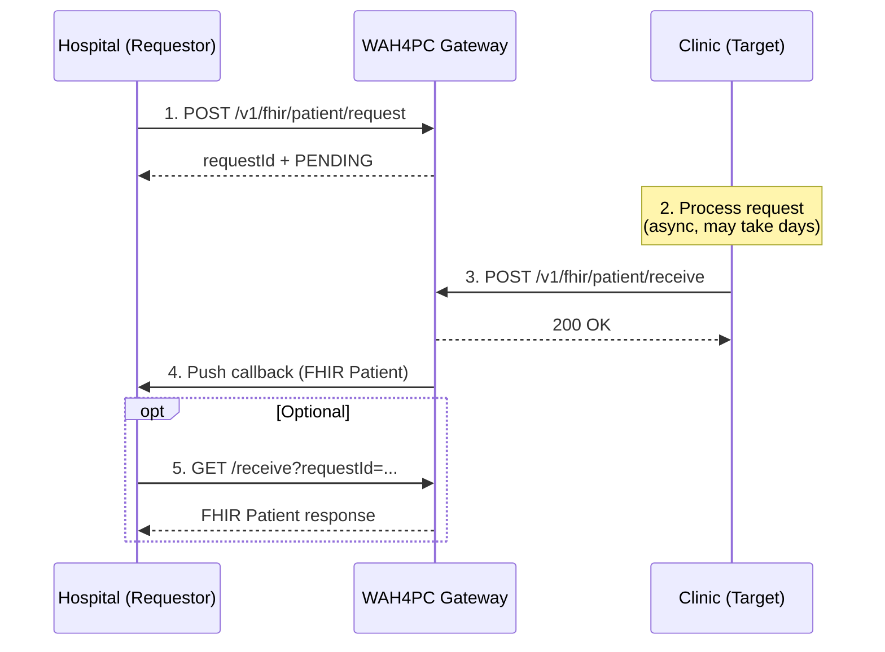

# WAH4PC Flow Overview

WAH4PC is an API gateway orchestrator for healthcare interoperability. It enables secure, standardized data exchange between healthcare systems using FHIR R4 (4.0.1) Patient resources.

---

## Core Concept

WAH4PC acts as a **central hub** between healthcare providers:



---

## Step-by-Step Flow

### 1. Provider Registration

Before any data exchange, all providers must register with WAH4PC:

```
POST /v1/provider
```

Each provider specifies:
- Their identity (`providerId`, `name`, `type`)
- Their API location (`baseUrl`)
- Where they receive requests (`endpoints.patientRequest`)
- Where they receive pushed responses (`callback.patientResponse`)

### 2. Hospital Creates Request

Hospital wants patient data from a clinic:

```
POST /v1/fhir/patient/request
{
  "requestorProviderId": "HOSPITAL_001",
  "targetProviderId": "CLINIC_001",
  "patientReference": {
    "identifiers": [{ "system": "NATIONAL_ID", "value": "123456789" }]
  }
}
```

WAH4PC returns a `requestId` with status `PENDING`.

### 3. Clinic Processes Request

The clinic (target) processes the request on their own timeline. This could be:
- Immediate (seconds)
- Delayed (hours, days, or longer)

The clinic retrieves pending requests through their own integration with WAH4PC (future: WAH4PC will push to `endpoints.patientRequest`).

### 4. Clinic Sends Response

When ready, the clinic sends the FHIR Patient resource:

```
POST /v1/fhir/patient/receive
{
  "requestId": "REQ-20251205-0001",
  "fromProviderId": "CLINIC_001",
  "fhirPatient": { ... FHIR Patient JSON ... },
  "status": "COMPLETED"
}
```

### 5. WAH4PC Pushes to Hospital

WAH4PC automatically POSTs the response to the hospital's `callback.patientResponse` URL:

```json
{
  "requestId": "REQ-20251205-0001",
  "fromProviderId": "CLINIC_001",
  "toProviderId": "HOSPITAL_001",
  "status": "COMPLETED",
  "fhirPatient": { ... }
}
```

### 6. Hospital Can Also Pull

At any time, the hospital can check status or retrieve the response:

```
GET /v1/fhir/patient/receive?requestId=REQ-20251205-0001
```

---

## Key Design Decisions

| Aspect | Decision |
|--------|----------|
| **Async by default** | Requests don't block; responses can arrive later |
| **Push + Pull** | Responses are pushed to callback, but pull is always available |
| **FHIR R4 4.0.1** | Patient resources follow FHIR R4 standard |
| **Provider-agnostic** | External systems adapt to WAH4PC format, not vice versa |
| **No security (v1)** | Authentication/authorization deferred for initial development |

---

## Request Statuses

| Status | Meaning |
|--------|---------|
| `PENDING` | Request created, waiting for target to respond |
| `COMPLETED` | Target sent FHIR Patient successfully |
| `FAILED` | Target could not fulfill the request |
