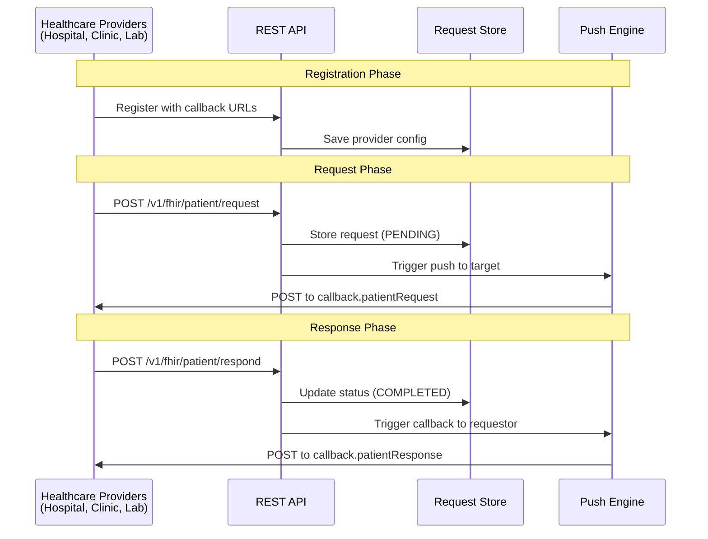
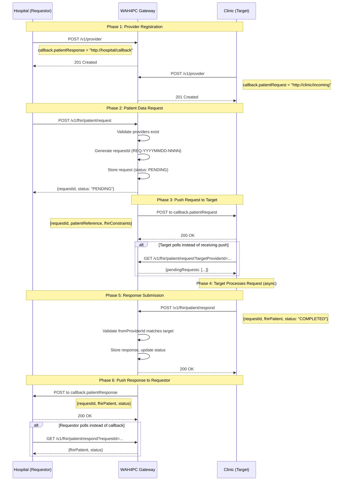
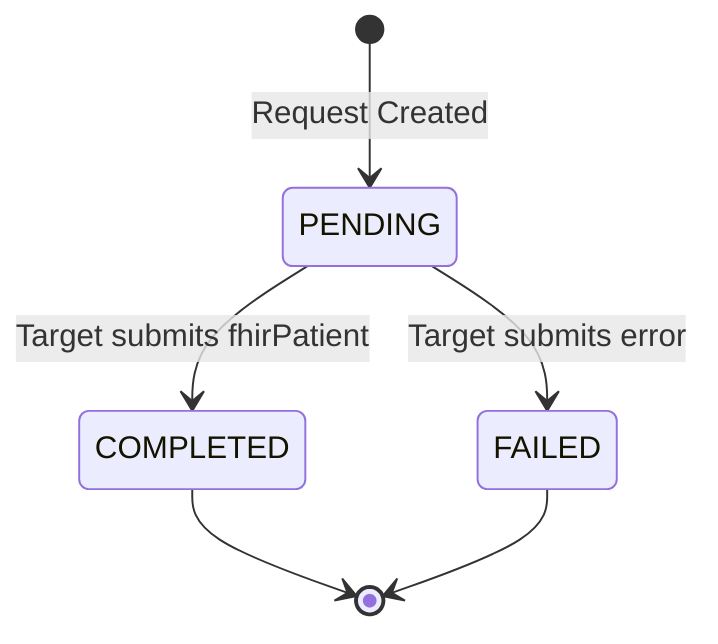

# WAH4PC Flow Overview

WAH4PC is an API gateway orchestrator for healthcare interoperability. It enables secure, standardized data exchange between healthcare systems using FHIR R4 (4.0.1) Patient resources.

---

## Architecture Overview

WAH4PC is a Go-based API gateway that orchestrates asynchronous patient data exchange between registered healthcare providers (hospitals, clinics, labs, pharmacies).

---

## Complete Sequence Diagram

---

## Six Flow Phases

### Phase 1: Provider Registration

Both the requestor (e.g., Hospital) and target (e.g., Clinic) must register with WAH4PC before exchanging data. Registration includes callback URLs for receiving pushed notifications.

**Callbacks:**
- `callback.patientRequest` - URL where WAH4PC pushes incoming requests (for targets)
- `callback.patientResponse` - URL where WAH4PC pushes responses (for requestors)

---

### Phase 2: Request Creation

The requestor creates a patient data request specifying the target provider and patient identifiers. WAH4PC validates both providers exist, generates a unique requestId, and stores the request with PENDING status.

---

### Phase 3: Push to Target

WAH4PC immediately pushes the request to the target provider's `callback.patientRequest` URL. If the target doesn't have a callback configured, they can poll for pending requests instead.

---

### Phase 4: Async Processing

The target provider processes the request asynchronously. This may involve manual review, data retrieval from internal systems, or approval workflows. This phase can take minutes, hours, or even days.

---

### Phase 5: Response Submission

The target submits the FHIR Patient resource back to WAH4PC. The gateway validates that the `fromProviderId` matches the original target, stores the response, and updates the request status to COMPLETED or FAILED.

---

### Phase 6: Push to Requestor

WAH4PC automatically pushes the FHIR Patient data to the requestor's `callback.patientResponse` URL. The requestor can also poll for the response if the callback fails or isn't configured.

---

## Key Concepts

### Async by Default

Healthcare requests often require manual review or approval. WAH4PC is designed to handle long-running transactions where responses may take hours or days.

### Bidirectional Push

WAH4PC pushes requests to targets AND responses to requestors. Both directions support polling as a fallback mechanism.

### FHIR R4 Standard

All patient data is exchanged using the HL7 FHIR R4 (4.0.1) Patient resource format to ensure interoperability between different healthcare systems.

### Provider Validation

WAH4PC validates that both requestor and target providers are registered, and that responses come from the correct target provider.

---

## Request Status Lifecycle

| Status | Description |
|--------|-------------|
| `PENDING` | Request created, awaiting response from target |
| `COMPLETED` | Target submitted FHIR Patient data successfully |
| `FAILED` | Target could not fulfill the request |